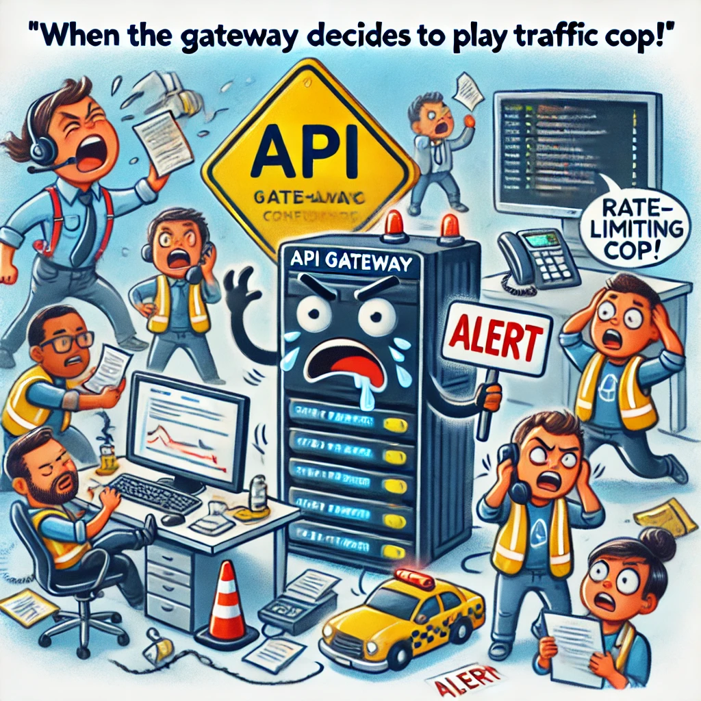

# Postmortem: API Gateway Outage

## Issue Summary
- **Duration**: The outage lasted from 14:30 to 15:45 UTC on August 16, 2024.
- **Impact**: During the 1 hour and 15-minute outage, 80% of users experienced significant delays or were unable to access our API services. This affected critical services such as payment processing, account management, and third-party integrations.
- **Root Cause**: The root cause of the outage was a misconfiguration in the API Gateway’s rate-limiting rules that caused the gateway to block legitimate traffic, mistaking it for a Distributed Denial of Service (DDoS) attack.

## Timeline
- **14:30 UTC**: The issue was detected when our monitoring system triggered an alert due to a sharp drop in API response rates.
- **14:32 UTC**: Engineers began investigating the alert, initially suspecting a network issue or a DDoS attack due to the sudden traffic spike.
- **14:35 UTC**: The networking team was involved to analyze incoming traffic and server logs.
- **14:40 UTC**: Misleadingly, the investigation focused on potential external threats, causing a delay in identifying the real issue.
- **14:50 UTC**: Customer Support reported several complaints from users experiencing service downtime.
- **15:00 UTC**: The incident was escalated to the DevOps team, who began checking the API Gateway configuration.
- **15:15 UTC**: The misconfiguration in the rate-limiting rules was identified.
- **15:30 UTC**: The rate-limiting configuration was rolled back to the previous stable version.
- **15:45 UTC**: API services were fully restored, and normal traffic flow was observed.

## Root Cause and Resolution
The outage was caused by a recent update to the API Gateway’s rate-limiting configuration. The update inadvertently tightened the rate limits, causing the gateway to block a large portion of legitimate traffic. The configuration change was meant to enhance protection against DDoS attacks by lowering the threshold for traffic spikes, but it was not adequately tested in a staging environment before deployment.

To resolve the issue, the DevOps team rolled back the rate-limiting rules to the last known stable configuration. This immediately restored the traffic flow, allowing users to access the API services without further disruption.

## Corrective and Preventative Measures

**Improvements**:
- Strengthen the testing procedures for configuration changes, particularly for critical infrastructure components like the API Gateway.
- Enhance monitoring capabilities to differentiate between legitimate traffic spikes and actual DDoS attacks.

**Tasks**:
1. **Implement a Staging Environment for API Gateway**: Ensure that all configuration changes are tested in a staging environment before going live.
2. **Review and Update Rate-Limiting Policies**: Re-evaluate the rate-limiting thresholds to balance security and availability.
3. **Automate Rollback Procedures**: Develop automated scripts to roll back configurations quickly in case of failure.
4. **Expand Monitoring**: Add more granular monitoring for API traffic to better detect and analyze traffic patterns.
5. **Conduct a Post-Deployment Review**: Establish a protocol for reviewing the impact of deployments within the first hour to catch any unintended consequences early.
